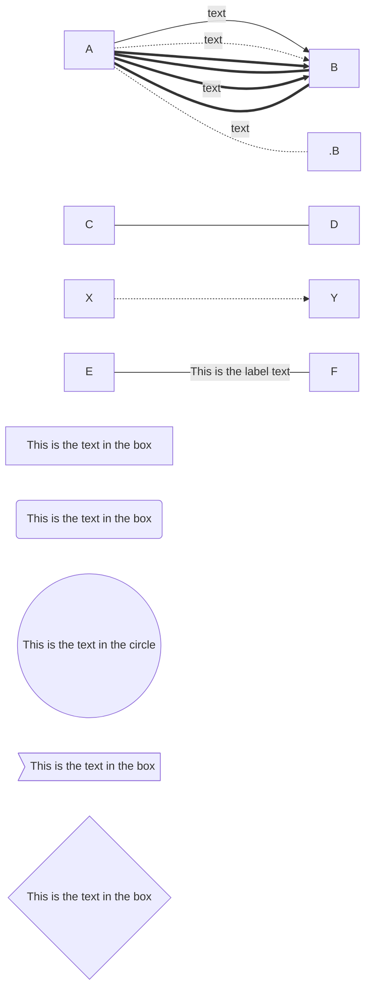
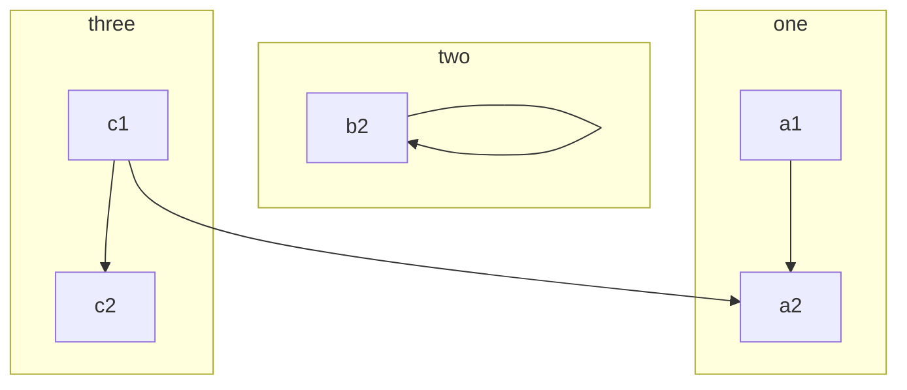
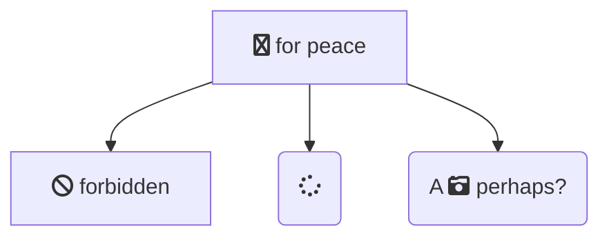
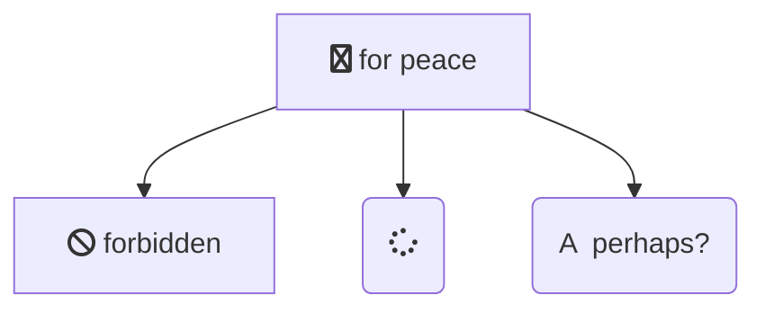
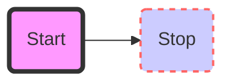
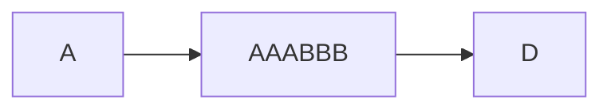
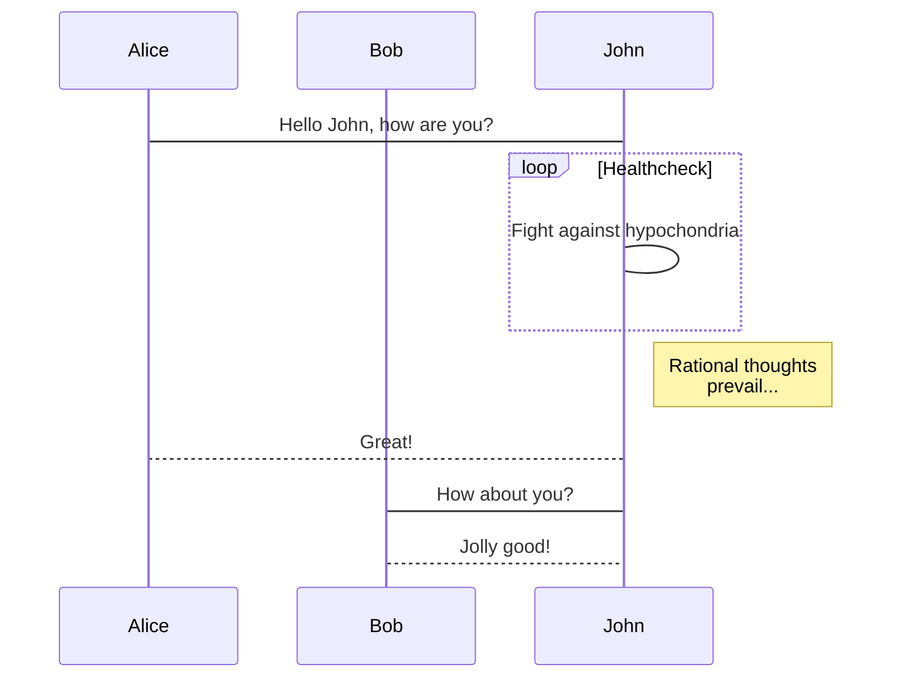
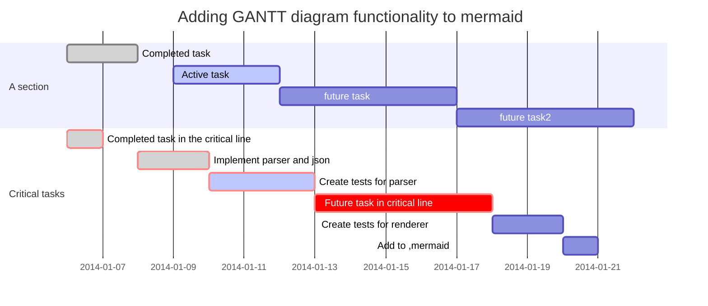

# Markdown画图

这是申明一个由左到右水平向右的图

- TB - top bottom
- BT - bottom top
- RL - right left
- LR - left right
- TD - same as TB

name | 111 | 222 | 333 | 444
- | :-: | :-: | :-: | -:
aaa | bbb | ccc | ddd | eee|
fff | ggg| hhh | iii | 000|