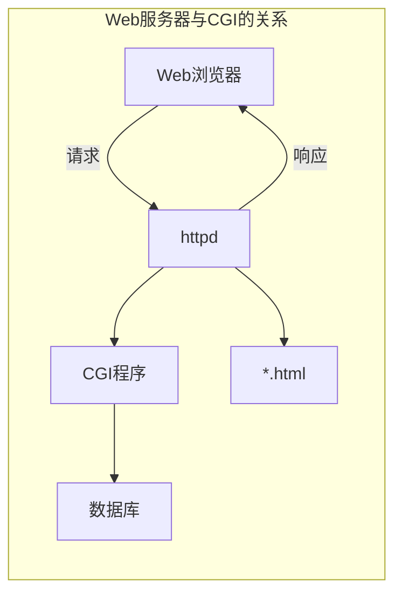
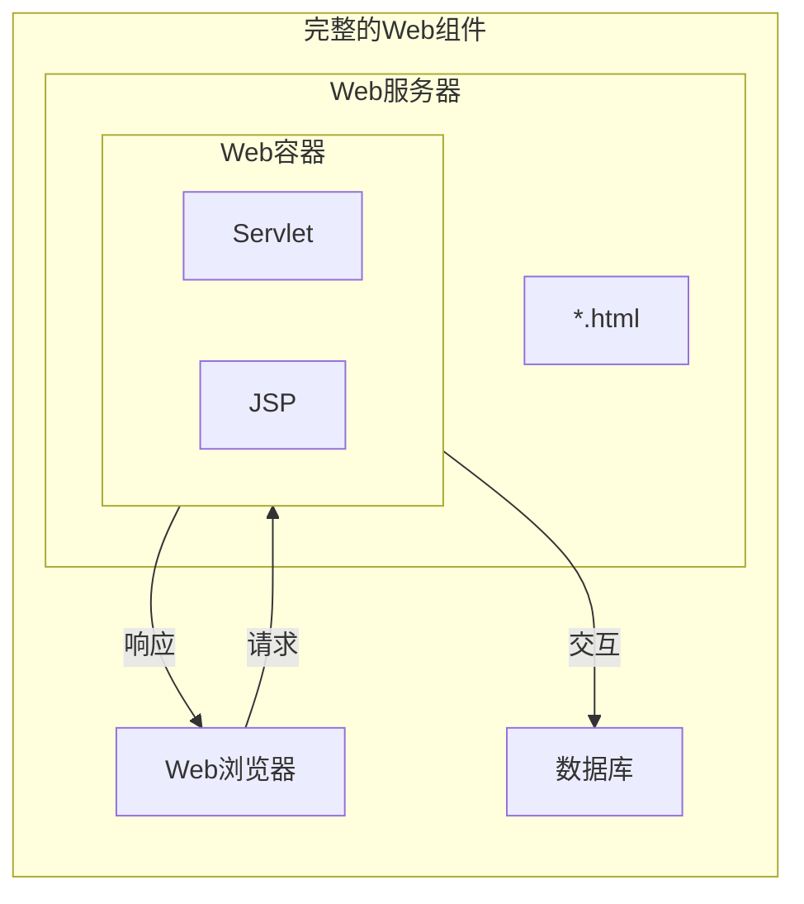
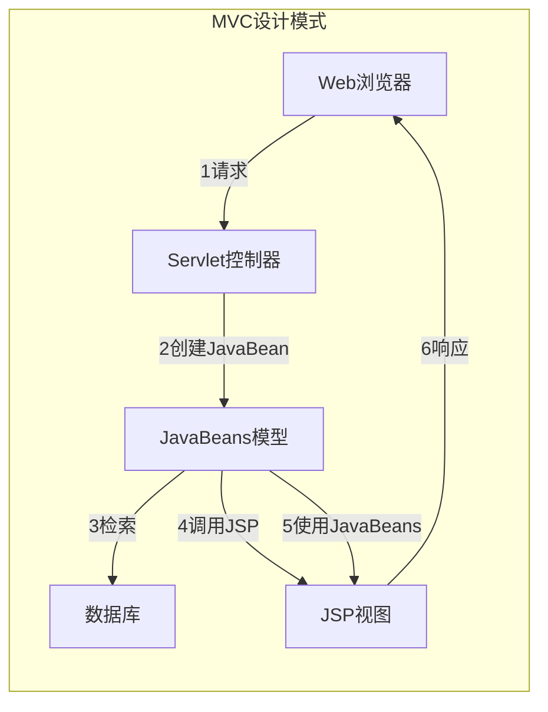

# 服务器资源

## 主动资源与被动资源

    1. 当浏览器向http://www.baidu.com/index.html 发送一个请求,Web服务器就在baidu.com上查找index.html文件
    2. 找到后将文件内容发送给浏览器,又称为静态资源
    3. 当浏览器向http://www.baidu.com/reportServlet 发送一个请求,Web服务器就在baidu.com上将请求转发给reportServlet
    4. 该reportServlet将执行生成HTML文件并把它发送给服务器,服务器将其转发给浏览器,该Servlet就是一个主动资源

## 静态文档与动态文档

    1. 静态文档创建完成后存放在Web服务器上,在被用户浏览的过程中不会发生变化,用户每次对文档访问所得的结果都是一样的
    2. 动态文档是指文档的内容可以根据需要动态生成,动态文档技术又分为服务端动态文档技术和客户端动态文档技术

### 服务端动态文档技术

#### CGI公共网关接口技术

    1. 公共网关接口技术是在服务器端生成动态Web文档的传统方法,CGI是一种标准化的接口,允许Web服务器与后台程序和脚本通信
    2. 这些后台程序和脚本能够接受输入信息(例如来自表单的数据),访问数据库,最后生成HTML页面作为响应

    3. 服务器进程httpd在接收到一个对CGI程序的请求时并不返回该文件,而是执行该文件然后将执行结果发送回服务器
    4. 从CGI到服务器的连接是通过标准输出实现的,所以CGI程序发送给标准输出的任何内容都可以发送给服务器,服务器再将其发送回浏览器
    5. CGI程序的主要优点是灵活性,可以使用任何语言编写CGI程序

#### 服务器扩展技术

    尽管CGI技术提供了模块化的设计方法,但缺点是效率低,对CGI每次调用都会创建一个操作系统进程
    此外脚本文件使用文件输入输出与服务器通信,大大增加了响应时间
    一个更好的方法是使服务器支持单独的可执行模块,当服务器启动时该模块就装入内存并只初始化一次
    然后通过已经驻留在内存中准备提供服务的模块副本为每个请求提供服务
    在Java平台上服务器扩展是使用Servlet API编写的,服务器扩展模块叫做Servlet容器

#### 在HTML文件中嵌入脚本技术

    在Web页面中嵌入某种语言的脚本,让服务器来执行这些脚本生成发送给客户端的页面

### 客户端动态文档技术

    通常采用JavaScript结合DOM技术实现客户端动态文档技术,客户端动态文档技术与服务端动态文档技术是不一样的,采用客户端动态文档技术的页面,代码是在客户端执行的

### Web容器

    Web服务器使用一个单独的模块装载和运行Servlet与JSP页面,这个模块成为Servlet容器或Web容器,Tomcat就是一个Web容器

    当浏览器向Web服务器发送请求,如果请求的目标是HTML文件,Web服务器可以直接处理
    如果请求的是Servlet或JSP页面,服务器将请求转发给Web容器,容器将查找并执行该Servlet或JSP页面
    Tomcat作为一个Web容器可以有三种运行方式
        1. 独立运行的   既作为服务器又作为容器运行,包含两个模块:主Web服务器处理静态内容和Web容器处理Servlet和JSP
        2. 进程内运行的
        3. 进程外运行的

### MVC设计模式

    Sun推出Servlet技术的目的是为了替代CGI编程,可以将Servlet看成是含有HTML的Java代码
    但Servlet的缺点是业务逻辑和表示逻辑不分,所以又推出了JSP技术
    可以将JSP看成是含有Java代码的HTML页面,JSP本质上也是Servlet
    Sun在推出JSP技术之后提出了建立Web应用程序的两种体系结构方法,两者的差别在于处理请求的方式不同

#### Model 1体系结构

    每个请求目标都是JSP页面,JSP页面负责完成所有请求所需要的所有任务,包括验证客户/使用JavaBean访问数据库/管理用户状态等
    响应结果也是通过JSP页面发送给用户
    该结构中没有一个核心组件控制应用程序的工作流程,所有业务处理都是用JavaBean实现
    缺点:
        大量实现业务逻辑的Java代码嵌入JSP
        代码不具备可重用性,例如为一个JSP页面编写的用户验证代码无法在其他页面使用

#### Model 2体系结构MVC

    将Web组件分为模型视图控制器,每种组件各自完成任务
    所有请求目标都是Servlet或Filter,充当应用程序控制器
    Servlet分析请求并将相应所需要的数据收集到JavaBean对象或POJO对象,该对象作为应用程序的模型
    最后Servlet控制器将请求转发到JSP页面
    这些JSP页面使用存储在JavaBean中的数据产生响应,构成应用程序的视图

    该模型最大优点是将业务逻辑和数据访问从表示层分离
    控制器提供单一入口,提供了较为清晰的实现安全性和状态管理的方法,并且这些组件可以重用
    然后根据客户请求,控制器将请求转发给合适的表示组件,由该组件响应客户
    Web页面开发人员可以专注于数据表示,因为JSP不包含任何复杂的业务逻辑